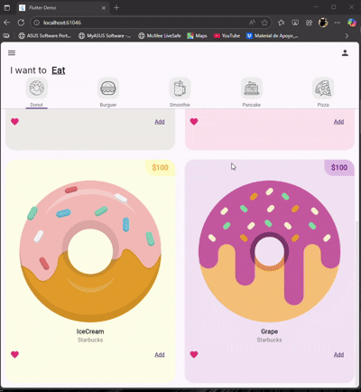

# 🍩Donut-App

Welcome to Donut App, a visually appealing Flutter application where you can browse and choose delicious foods and desserts through a clean, modern interface. 

---

## ✨ Features

- Dribbble-inspired design: Clean, minimal, and elegant interface.

- Category navigation: Choose between Donut, Burger, Smoothie, Pancake, Pizza, and more.

- Price tags: Each product displays its price in the top-right corner.

- Favorites: Tap the heart icon to mark your favorite items.

- Add to cart: Quickly add items using the Add button.

- Responsive layout: Smooth experience across desktop, web, and mobile screens.

---

## 🛠️ Requirements

- Flutter 3.x or higher  
- Dart 3.x  

🚀 Installation

1- Clone the repository:
```
git clone <your_project_url>
```
2- Navigate to the project folder:
```
 cd donut_app
```
3- Install dependencies:
```
flutter pub get
```
4- Run the project:
```
flutter run
```
#  Usage
1- Launch the app — you’ll see the “I want to Eat” interface with multiple food categories.

2- Select a category (e.g., 🍩 Donut or 🍔 Burger).

3- Browse through the product cards showing images, names, prices, and sources (e.g., Starbucks).

4- Press Add to add items to your cart or tap 💖 to mark them as favorites.
#
📂 Project Structure
```
lib/
 ├─ main.dart            # Entry point
 ├─ home_page.dart       # Main screen with category tabs
 ├─ components/
 │   ├─ donut_tab.dart   # Donut category layout
 │   ├─ burger_tab.dart  # Burger category layout
 │   ├─ food_tile.dart   # Reusable food card widget
assets/
 ├─ images/              # Product and UI assets
pubspec.yaml             # Flutter configuration and dependencies

```
#
🎨 DEMO: 
#


Developed by hello@dstudio.agency

Design concept inspired by Dribbble — implemented with Flutter for learning and UI showcase purposes. 
